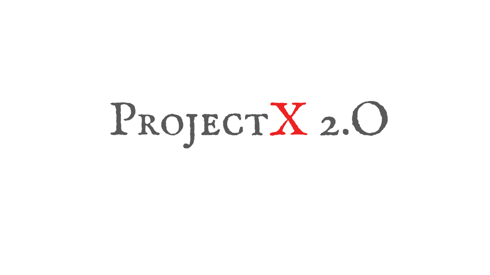

<h1 align="center">
   
   
   
</h1>

------

**ProjectX** is the program run by Aficionados (Programming Society, NIT Goa) which aims at making newbies (**Cadets**) of campus aware about `fun, opportunities, challenges and realities` of Computer Science and its Sub-Streams. 

### How to get involved?
1. Cadets should apply for getting into teams based on Captains profile through this form.
:link: 
2. Specify your skill-set. `(Any MOOCs have taken before or any other relevant details)`
3. Captains will choose cadets(`one or more from each junior year`) which they will take under their team.
4. Done.

> Just getting started with programming? You can also apply through the same link, we will provide you with a better platform to learn and practice efficiently

### Then What?
1. Captain will guide, help and mentor his team members.
2. After deciding upon a time, Each team will choose a CS/IT topic and design relevant challenges on it.
3. After Knowing the topic other remaining teams will prepare for it, In which the captain will guide the team.
4. Teams will compete in the challenges.
5. LeaderBoard and archive will be maintained in this repo.

### Teams :triangular_flag_on_post:

| `Team`| `Captain`| `Experiences/Interests`| `Contact` | `Profile` |
|:---:|:---------:|:---:|:---:|:---:|
| |Gautam Mishra \| Rahul Priolkar| | | |
| Code Connoisseurs | [Archit](https://www.linkedin.com/in/garg4/) \| [Sangram Patil]() | Data Structure & Algorithms \| Deep Learning \| Web Dev | | [Profile 1] \|  |
| | Ashutosh Kabra \| Aditya Tirmanwar| Data Structure & Algorithms \| Game Theory \| ML \| Cloud Computing \| Web Dev | | |
| Conquerers in Action | Prakhar Gupta \| Saswat Anoop| Data Structure & Algorithms(CP) \| ML \| Android Dev \| Cross Platform App Dev \| Data Science | | |
| Innoverts | Ved Prakash \| Anit Mahato| Data Structure & Algorithms \| ML \| Deep Learning \| Android Dev \| Cross Platform App Dev| | |

### Cadets:
| `Team`| `Cadets`|
|-|-|

----

### Challenges:
#### Coming soon...

----

### LeaderBoard: 
#### Coming soon...

----

  Aficionados, NIT Goa

